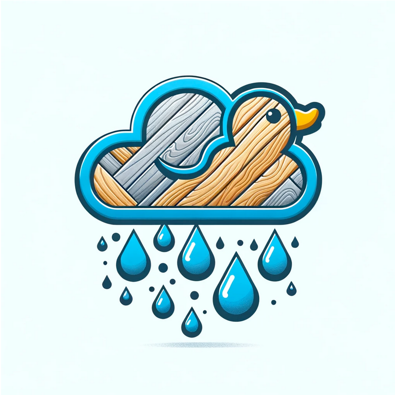

# hackathon-meteo-team-tls

Ce repo contient le travail de l'équipe Team TLS réalisé lors du [Hackathon météo](https://www.data.gouv.fr/fr/posts/hackathon-donnees-ouvertes-meteo-france-venez-valoriser-les-donnees-publiques-meteorologiques/) organisé par Météo France les 08 et 09 avril 2024.

Le projet est la Dalle Météo

# Présentation
Equipe (en distanciel) ACCÈS ET COMPREHENSION DES DONNEES

# Membres 
* Sébastien Bourgeois (Data engineer)
* Maxime  Pawlak (Développeur)
* Thomas Sigward (Project management / Développeur front-end)

# Rendus
Les rendus sont disponibles dans le dossier [rendus](./rendus)
* [Intermédiaire - Jour 1](./rendus/Rendu-Jour-1.md)
* [Rendu](./rendus/Rendu.md)

# Applications
Le projet est composée de plusieurs applications : 
* [Application data](./app-data/) qui gère la transformation des données
* [Application front](./app-front) qui est l'interface web
* [Module LLM](./llm) qui est les éléments pour faire fonctionner le LLM dans l'application front

# Liens utiles
* https://guides.data.gouv.fr/guide-du-participant-au-hackathon-meteo
* https://gdal.org/drivers/vector/parquet.html
* https://duckdb.org/
* https://cesium.com/
