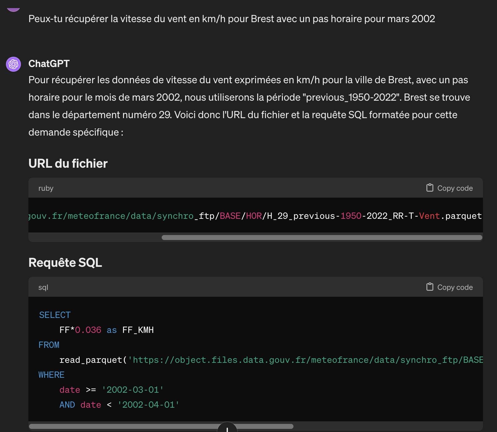
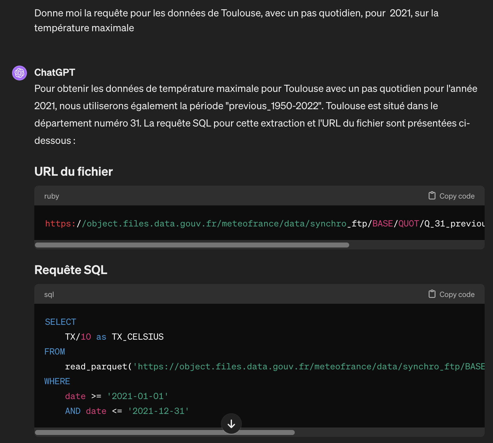

# Introduction

Ce dossier regroupe les éléments au sujet des LLMs.

Le fichier [prompts_LLM.md](prompts_LLM.md) contient les prompts permettant d'affiner le modèle.

Nous avons testé à ce jour uniquement avec Chat-GPT4 par souci de rapidité.

Dans une démarche plus orientée vers l'open-source, nous nous orienterons vers des modèles ouverts comme Llama 2 (Meta), Mistral 7B (Mistral AI) ou encore CroissantLLM. La liste complète peut être retrouvée sur [Hugging Face](https://huggingface.co/models?pipeline_tag=text-generation). 

# Exemples

## Requête 1
```
Peux-tu récupérer la vitesse du vent en km/h pour Brest avec un pas horaire pour mars 2002 
```


### Réponse
```sql
SELECT 
    FF*0.036 as FF_KMH 
FROM 
    read_parquet('https://object.files.data.gouv.fr/meteofrance/data/synchro_ftp/BASE/HOR/H_29_previous-1950-2022_RR-T-Vent.parquet') 
WHERE 
    date >= '2002-03-01' 
    AND date < '2002-04-01'
```

## Requête 2

```
Donne moi la requête pour les données de Toulouse, avec un pas quotidien, pour  2021, sur la température maximale
```



### Réponse
```sql
SELECT 
    TX/10 as TX_CELSIUS 
FROM 
    read_parquet('https://object.files.data.gouv.fr/meteofrance/data/synchro_ftp/BASE/QUOT/Q_31_previous-1950-2022_RR-T-Vent.parquet') 
WHERE 
    date >= '2021-01-01' 
    AND date <= '2021-12-31'
```

